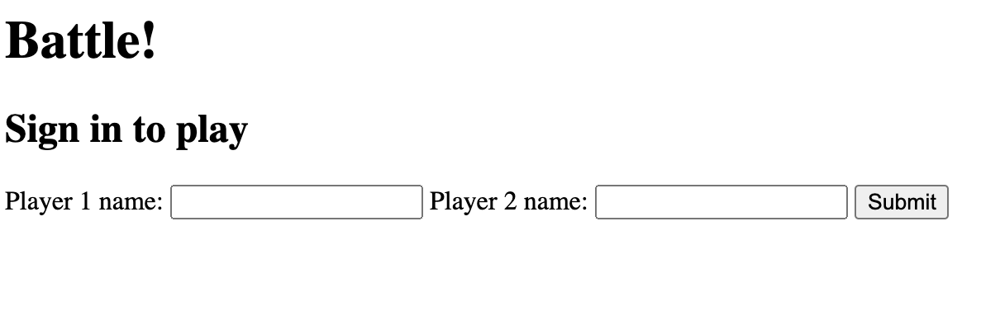
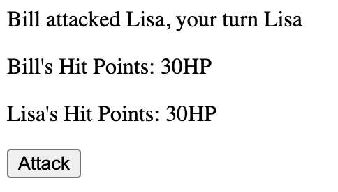

# BattleWebApp

Building an understanding of HTTP, response-request mechanisms, Sinatra, and Capybara nad construct a project that uses these technologies.

Set up a basic project structure with Sinatra, RSpec, and Capybara.

Each day I have been pairing with a different person. The result of each pairing session has been push on a separate branch.

### User stories


```
As two Players,
So we can play a personalised game of Battle,
We want to Start a fight by entering our Names and seeing them

As Player 1,
So I can see how close I am to winning
I want to see Player 2's Hit Points

As Player 1,
So I can win a game of Battle,
I want to attack Player 2, and I want to get a confirmation

As Player 1,
So I can start to win a game of Battle,
I want my attack to reduce Player 2's HP by 10

As two Players,
So we can continue our game of Battle,
We want to switch turns

As Player 1,
So I can see how close I am to losing,
I want to see my own hit points

As Player 1,
So I can lose a game of Battle,
I want Player 2 to attack me, and I want to get a confirmation

As Player 1,
So I can start to lose a game of Battle,
I want Player 2's attack to reduce my HP by 10

As a Player,
So I can Lose a game of Battle,
I want to see a 'Lose' message if I reach 0HP first
```


## How to run

```
git clone repo
cd Battle
bundle install
rackup
```

## **Home**


## **Player attack**


## **Final score**
